# Proyecto de Rutinas de Entrenamiento

Este proyecto es una aplicación Android para la gestión de rutinas de entrenamiento semanal, permitiendo al usuario crear, modificar, copiar, eliminar y calendarizar rutinas y ejercicios de forma personalizada.

> **Nota:**  
> Esta aplicación ha sido creada como práctica y aprendizaje personal, tomando como referencia la aplicación [EffortApp](https://play.google.com/store/apps/details?id=com.aleixplanasg.Efort).  
> Aunque se inspira en su diseño y funcionamiento, **no incluye todas las funcionalidades de la aplicación original** y su desarrollo no está afiliado a EffortApp ni a sus desarrolladores.

## Tecnologías y Arquitectura

- **Kotlin**: Lenguaje principal de desarrollo.
- **MVVM (Model-View-ViewModel)**: Patrón de arquitectura para separar la lógica de negocio de la interfaz de usuario.
- **Clean Architecture / Clean Code**: Principios de diseño para mantener el código modular, desacoplado y fácil de probar.
- **Room**: Librería de persistencia para la gestión local de la base de datos SQLite, utilizada para almacenar semanas, rutinas, ejercicios y fechas. La base de datos de la aplicación parte de un archivo en la carpeta `assets`, el cual incluye una lista predefinida de ejercicios. 
- **Firebase**: Integración para autenticación y almacenamiento remoto, así como para la funcionalidad de compartir entrenamientos mediante un código único entre usuarios.
- **Dagger Hilt**: Inyección de dependencias para facilitar la escalabilidad y pruebas.
- **Coroutines + StateFlow**: Programación reactiva y asincrónica para gestionar estados de la interfaz y operaciones de base de datos.
- **Navigation Component**: Para la navegación entre fragmentos de la app.
- **Material Components y XML layouts**: Diseño visual basado en Material Design mediante layouts en XML.
- **RecyclerView + Adapters**: Listas dinámicas y personalizables para semanas, rutinas y ejercicios.
- **BottomSheetDialogFragment & DialogFragment**: Uso de diálogos personalizados para interacción avanzada (selección de semana, calendario, confirmaciones, etc).

## Estructura General

- **data/**: Modelos de datos, entidades Room y DAOs.
- **domain/**: Casos de uso y lógica de negocio.
- **presentation/**: Fragments, Activities, Adapters y ViewModels.
- **di/**: Definiciones para la inyección de dependencias con Hilt.

## Principales Funcionalidades

- **Gestión de Semanas**: Crear, copiar, eliminar y seleccionar semanas de entrenamiento.
- **Gestión de Rutinas**: Añadir, editar, eliminar, copiar y reordenar rutinas dentro de cada semana (con soporte drag&drop).
- **Gestión de Ejercicios**: Permite añadir y visualizar ejercicios en cada rutina.
- **Asignación de Fechas**: Calendarización de rutinas mediante diálogo personalizado y almacenamiento de fechas.
- **Compartir Entrenamientos**: Los entrenamientos pueden ser compartidos con otras personas mediante un **código de invitación** único. Usando Firebase, otro usuario puede introducir el código y obtener una copia del entrenamiento compartido, facilitando el intercambio social y la colaboración.
- **Interfaz Reactiva**: Actualización en tiempo real de la interfaz mediante StateFlow y LiveData.
- **Feedback Visual**: Uso de animaciones, shimmer, snackbars y menús contextuales para una experiencia de usuario fluida.
- **Multi-idioma**:  
  La aplicación dispone de soporte para **cambiar de idioma entre español e inglés** desde la propia interfaz de usuario, de forma sencilla y dinámica.
- **Lista de ejercicios desde assets**:  
  Al añadir ejercicios, el usuario dispone de una lista cargada desde los assets, donde puede filtrar por nombre o por categoría de forma visual e intuitiva.

## Ejemplo de Flujo de Usuario

1. El usuario selecciona un entrenamiento y accede a la vista de semanas.
2. Puede crear nuevas semanas, copiar una existente o eliminarla.
3. Dentro de una semana, puede añadir rutinas, cambiar su orden mediante arrastre, copiar rutinas o eliminarlas.
4. Puede asignar fechas a rutinas usando el calendario integrado.
5. Puede compartir un entrenamiento generando un código y enviándolo a otra persona, que podrá usarlo para importar el entrenamiento desde Firebase.
6. Toda la información se almacena localmente en Room, y puede sincronizarse y compartirse mediante Firebase.

## Dependencias principales (build.gradle)

```gradle
// Navegación entre fragmentos
implementation("androidx.navigation:navigation-fragment-ktx:2.7.1")
implementation("androidx.navigation:navigation-ui-ktx:2.7.1")

// Room (Persistencia local)
implementation("androidx.room:room-runtime:2.6.1")
implementation("androidx.room:room-ktx:2.6.1")
kapt("androidx.room:room-compiler:2.6.1")

// Firebase (usando BoM para versiones consistentes)
implementation(platform("com.google.firebase:firebase-bom:32.7.3"))
implementation("com.google.firebase:firebase-firestore")
implementation("com.google.firebase:firebase-auth")

// Dagger Hilt (Inyección de dependencias)
implementation("com.google.dagger:hilt-android:2.50")
kapt("com.google.dagger:hilt-compiler:2.50")

// Material Design
implementation("com.google.android.material:material:1.12.0")

// Coroutines (Programación asíncrona y reactiva)
implementation("org.jetbrains.kotlinx:kotlinx-coroutines-android:1.7.1")
implementation("org.jetbrains.kotlinx:kotlinx-coroutines-core:1.7.1")

// RecyclerView
implementation("androidx.recyclerview:recyclerview:1.4.0")

// AppCompat
implementation("androidx.appcompat:appcompat:1.6.1")

// ConstraintLayout
implementation("androidx.constraintlayout:constraintlayout:2.1.4")
```

## Notas de Desarrollo

- **Requiere Android 8.0+ (API 26+)**
- El proyecto sigue buenas prácticas de desacoplamiento y testabilidad.
- Los comentarios en el código explican cada fragmento y función relevante.

## Capturas de Pantalla

A continuación se muestran varias capturas de pantalla para ilustrar las principales pantallas y flujos de la aplicación.  

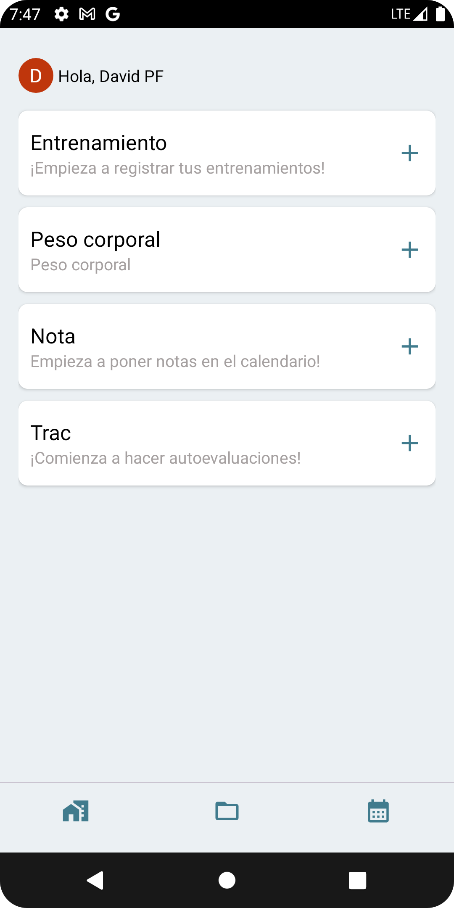
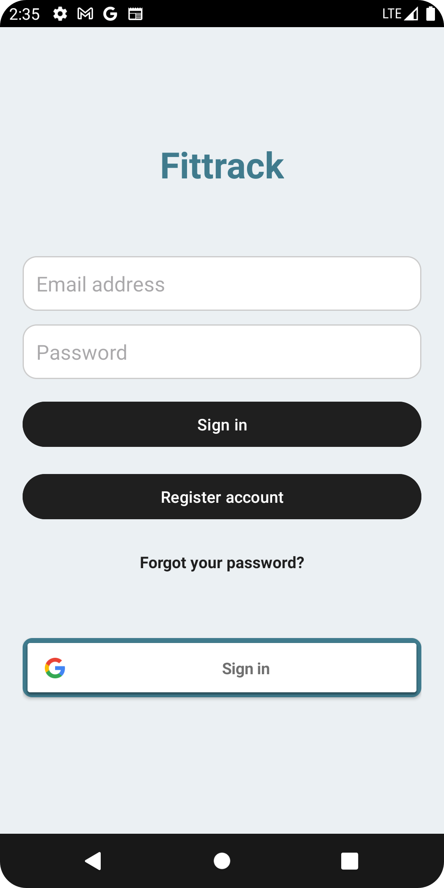
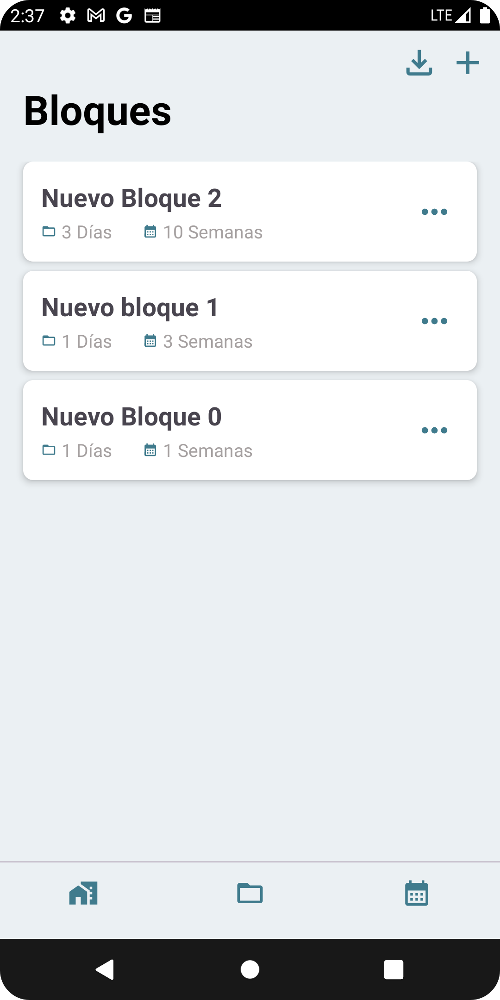
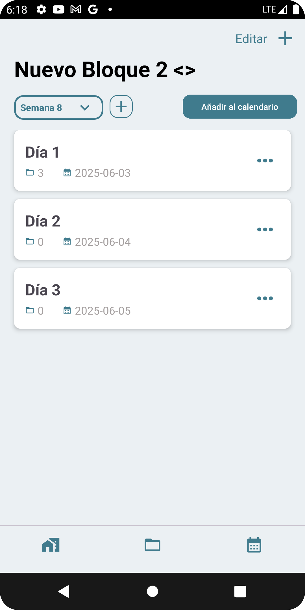
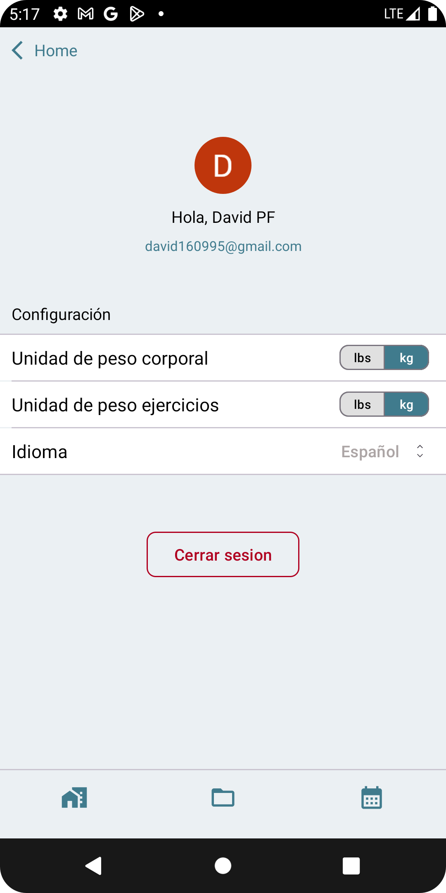
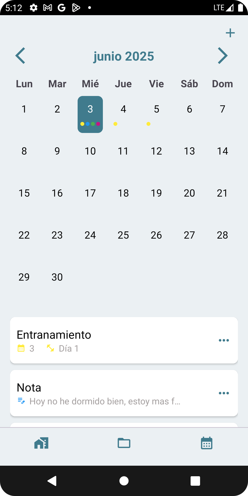
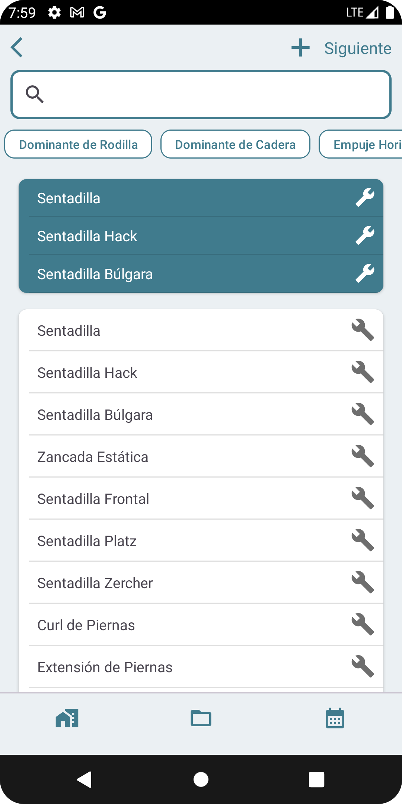
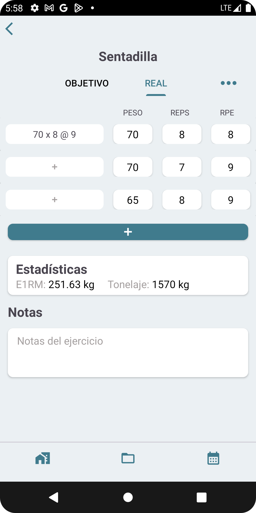
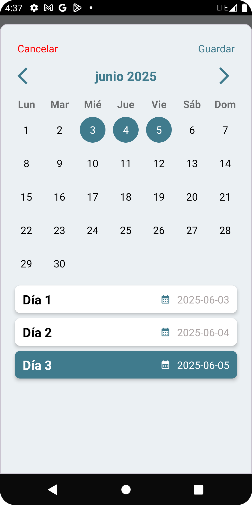
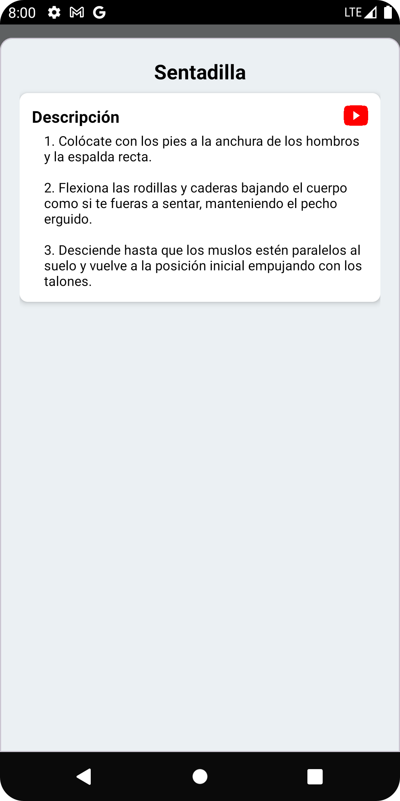
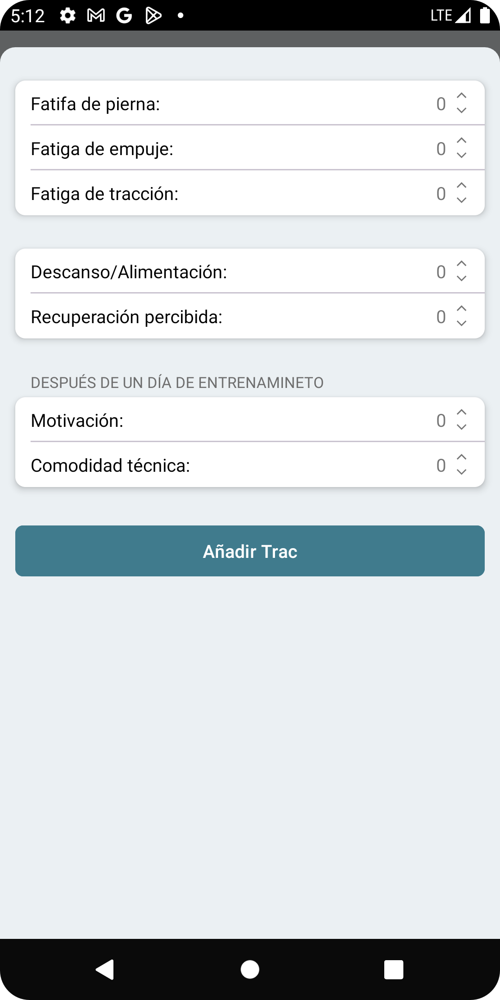

---


